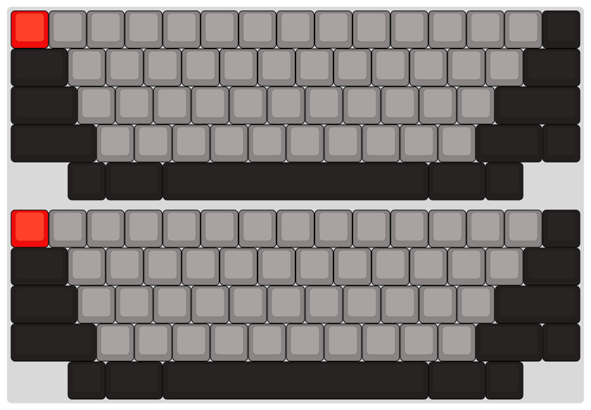

# HHKB:  The default keymap for KC60SE

## What defines the HHKB (US layout):
* [Esc] moves down replacing [ ~ ]
* 2u [Backspace] split into [ \ ] and [ ~ ]
* moving [Backspace] down a row to replace [  \  ]
* a dip switch toggles the default: Delete or Backspace, [Fn ] invokes non-default
* 2.75u [  Shift  ] split into 1.75u [Shift] & [Fn ]
* Control replaces Caplock, [FN ] [ Tab ] toggles Caplock, led under Control toggles w/Caplock
* the botom row layout does not really define the HHKB, other than it is configurable and Meta can be assign values for your OS
* HHKB Lite2

```
    |Fn |Alt |Meta|        Space          |Meta|Alt |
    |Fn |Meta|Alt |        Space          |ALt |Meta|
```
* HHKB Professional2

```
        |Alt |Fn  |        Space          |Meta|Alt |
        |Meta|Alt |        Space          |Alt |Meta|
        |Fn  |Alt |        Space          |Alt |Meta|
```
## Function Layer
* Extra keys: (mprv, mply, mnxt)
* I think the number pad * / - and + did not come on the Professional, but did on Lite

